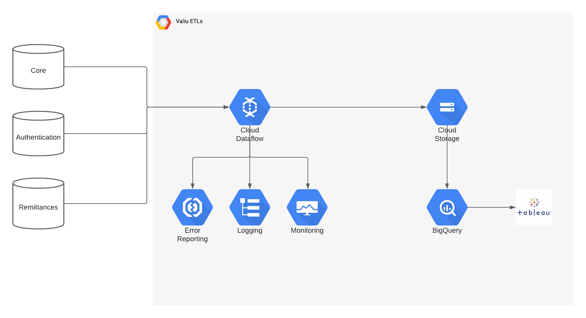
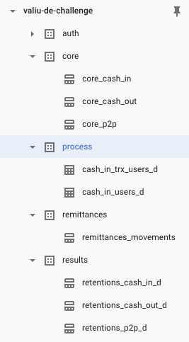
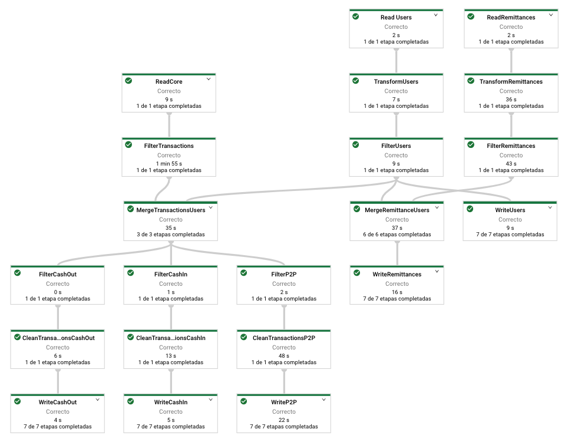
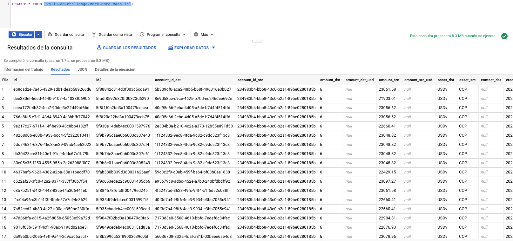
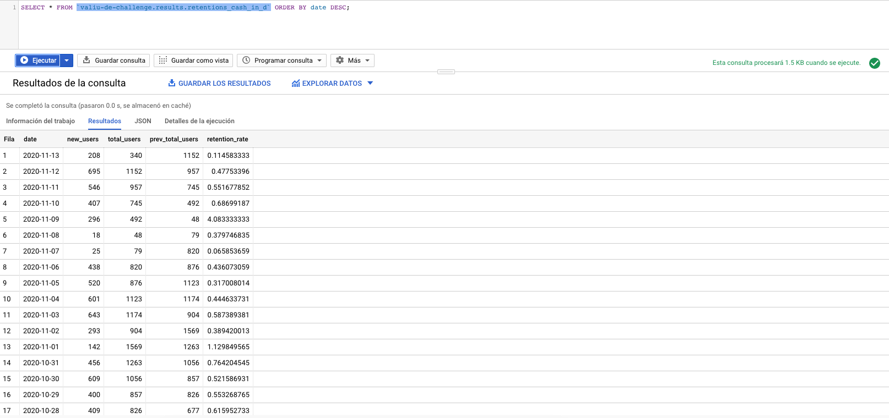

# ETLs Valiu

This project consists of a series of ETLs (Extract, Transform, Load) to ingest transactions and user data from relational and nonrelational databases to a Google BigQuery DataWarehouse and to calculate daily retention rates from those transactions.

The following image shows the architecture diagram of the system that consists of the data sources databases, Google Dataflow, Cloud Storage, BigQuery, and the Tableu system.


## Data Sources

There are three different data sources from different transactional and authentication systems:
- **Core:** A relational (SQL) database (PostgreSQL) that contains the transactions for cashi-ns, cashouts, and peer-to-peer transactions.
- **Auth:** A non-relational (NoSQL) database (MongoDB) that contains informations about the users. It is used as the database for the authentication system.
- **Remittances:** A relational (SQL) database (SQL Server) that contains transactions for remittances.

For simplicity, the SQL databases are deployed in Cloud SQL (Google Cloud) as fully-managed database instances. The NoSQL database is deployed on a virtual machine (VM) in Compute Engine (Google Cloud) as a self-managed database instance.

You can find the scripts to create the required tables in each system in `/sql/` directory.

## Data Warehouse

**Google BigQuery** was selected as the default Data Warehouse solution for this project because it is robust, scalable, serverless, and does not require maintenance. This data warehouse is organized into five datasets to maintain proper recognition of data, scalability, and data lineage. 

The first three datasets (core, auth, remittances) contains cleaned and transformed data directly from data sources. The processed dataset contains tables used for calculations, tables for testing queries, and tables created by users. the last dataset, results, contains curated information, already transformed, cleaned, and analyzed. It contains results from analytical models, experiments, etc., ready to be consumed.



## Sources ETL
This ETL uses Apache Beam to extract transactions from the core system, remittances from the remittances system, and users from authentication systems, to clean, transform, and insert into the data warehouse datasets.

The transactions data is split into three collections by its type (cash-in, cashout, peer-to-peer), cleaned, and joined with users collection to identify users information in transactions, finally, the data is inserted into core BigQuery dataset by its type(core_cash_in, core_cash_out, core_p2p) with an identical schema to facilitate merge in future analysis.

The remittance data is cleaned, filtered, transformed, and joined with users collection to identify users' information in remittances transactions, finally, the data is inserted into remittances BigQuery dataset (remittances_movements).

The users' data is cleaned, filtered, transformed, and inserted into auth BigQuery dataset (auth_users).

The previous flow is represented in the following pipeline.


**Requeriments:**
- A computer with good specifications and Python 3+ environment installed.
- Access and port openings to data source databases.
- A Google Cloud account with BigQuery, Cloud Storage, and Dataflow set.

To run the ETL you must have access to your Google Cloud account, contains a credentials JSON file and run the following command:
```bash
cd /<ROOT>/etl_operations/
GOOGLE_APPLICATION_CREDENTIALS=<CREDENTIALS_FILE> python main.py \
  --project <PROJECT_ID> \
  --region <REGION_ID> \
  --temp_location <TEMPORAL_BUCKET> \
  --setup=./setup.py \
  --core_host <CORE_HOST> \
  --core_port <CORE_PORT> \
  --core_username <CORE_USERNAME> \
  --core_password <CORE_PASSWORD> \
  --core_database <CORE_DATABASE_NAME> \
  --auth_uri <AUTHENTICATION_SYSTEM_URI> \
  --auth_database <AUTHENTICATION_SYSTEM_DATABASE_NAME>
```

_Reference: [Apache Beam official website](https://beam.apache.org/)_

## Retentions ETLs
These ETLs uses Apache Spark to extract data from raw data sources in the data warehouse (core, auth, and remittance systems), and calculate retention rates for cash-ins, cashouts, peer-to-peer, and remittances transactions, and insert it into BigQuery results tables.

### Transactions Retentions ETL
Use Apache Spark to read transactions data from any transaction schema table such as core_cash_in, core_cash_out, and core_p2p, calculate daily retention rates from the first date in the table to the last one and insert this information into a table in the results dataset.

**Example origin schema:**



**Example result schema:**



**Requeriments:**
- A computer with good specifications and Python 3+ environment installed.
- A Google Cloud account with BigQuery, Cloud Storage and Dataproc set.
- Google Cloud CLI configured.

To run the ETL script you must have access to your Google Cloud account, have datasets with correct schema, and run the following command:
```bash
cd /<ROOT>/etl_users_count/
gcloud dataproc jobs submit pyspark etl_core_retentions_daily.py \
  --cluster=<DATAPROC_CLUSTER_NAME> \
  --region=<REGION_ID> \
  --jars=gs://spark-lib/bigquery/spark-bigquery-latest_2.12.jar -- \
  --project=<PROJECT_ID> \
  --bucket=<TEMPORAL_BUCKET> \
  --core_table=<CORE_TRANSACTIONAL_TABLE_NAME> \
  --results_table=<RESULTS_TABLE_NAME>
```

_Reference: [Apache Spark official website](https://spark.apache.org/)_

